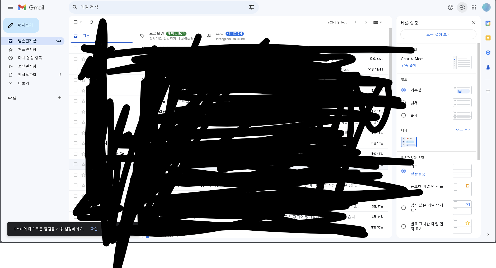
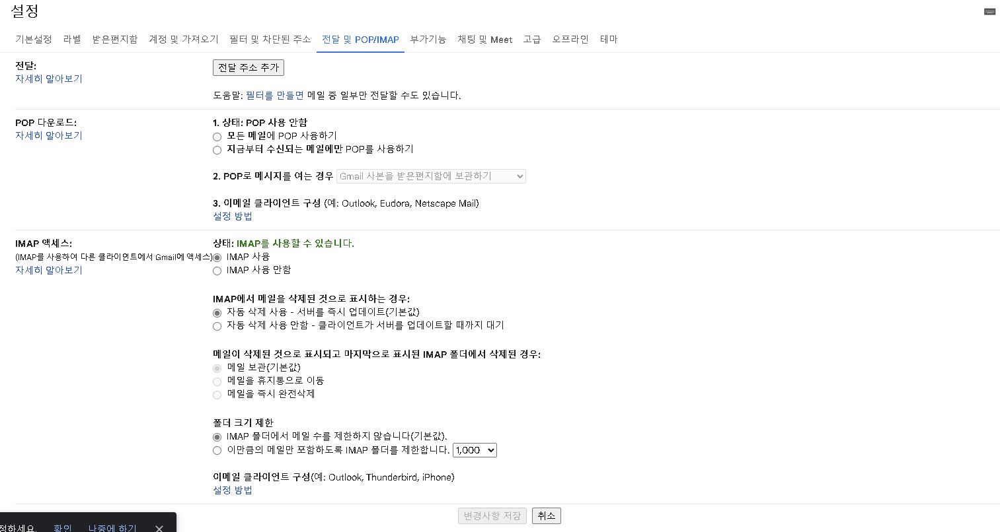
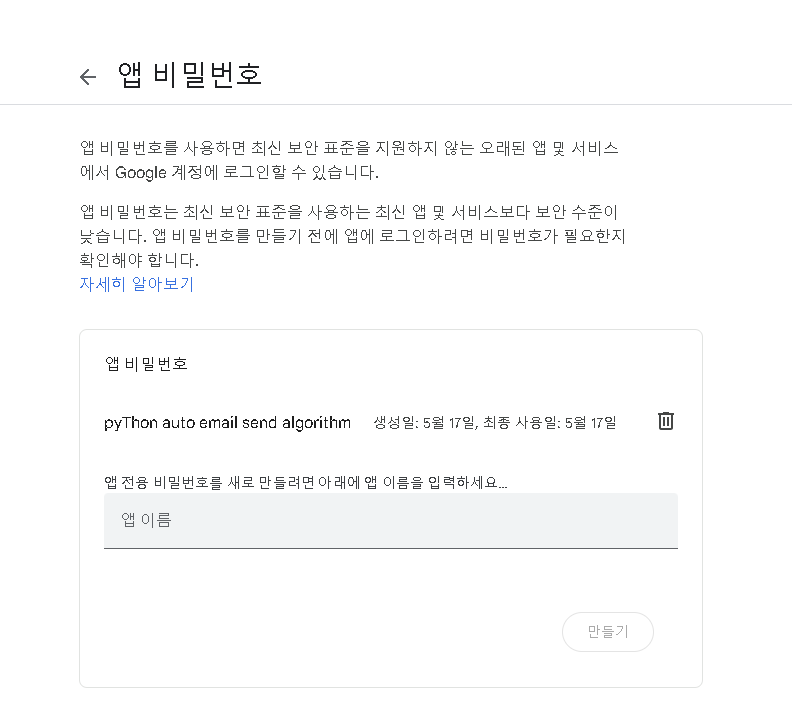

# 이 프로젝트는 누군가의 의뢰를 받아 제작된 프로젝트입니다.

### 파이썬을 이용한 자동화된 이메일 보내기

#### 우선 알아둬야 할 사항

##### 이 파일은 visual studio code 로 작성된 코드입니다. 그 외 다른 IDLE 를 사용하실려면 꼭 해당 프로젝트가 있는 경로에서 터미널을 여시길 바랍니다.

##### 또는 cmd 에서 이런 명령어를 입력하세요.

##### C:\Users\컴퓨터 이름\해당 경로\python project

##### pip install 할 필요 없음. 기본적으로 내장 되어있음.

##### 미완성이 있는 부분이 있을수도 있으니 시간 되는 대로 또 작성하겠습니다.

# 1. gmail 창에서 설정을 누르고, 전체 설정으로 들어가세요.

# 2. 전달 및 POP7\IMAP 항목에 들어가서 IMAP 엑세스로 들어간후 해당 그림을 보고 따라하사길 바랍니다.

# 3. 구글 보안에 들어가서 검색창에 앱 비밀번호 를 검색하시고, 해당 항목을 클릭해주세요.

# 4. 여기가지 오셨으면 이름을 입력하시고, 비밀번호를 입력하시고, 해당 코드 부분에 입력하세요.

# 5. 끗.

##### Made by 일구
##### 코드 문의: 202321316@sangmyung,kr

##### feat.노션너굴

